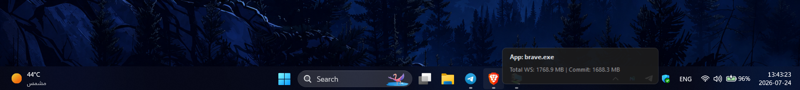

<div align="center">


<h1>MemHover</h1>

<p><strong>Hover. See. Optimize.</strong></p>

<p>A blazing-fast, zero-dependency Windows utility that surfaces real-time RAM metrics<br>for any application — instantly, just by hovering over its taskbar icon.</p>

<br/>

[](#)
[](#)
[](#)
[](#)

<br/>

</div>

---

## 📸 Preview

<div align="center">



</div>

---

## ✦ What is MemHover?

**MemHover** is a native Windows background utility engineered entirely in **Rust** using direct **Win32 API** and **UI Automation** calls. It detects the application currently under your cursor on the taskbar and overlays a crisp, transparent tooltip displaying its **real-time memory consumption** — all with near-zero overhead.

No Task Manager. No alt-tab. No interruptions. Just hover.

---

## ⚡ Features

| Feature | Description |
|---|---|
| 🖱️ **Hover Detection** | Identifies the app under the cursor using UI Automation — no hacks, no hooks |
| 📊 **Real-Time Metrics** | Displays Working Set (RAM) & Private Memory, refreshed every 200ms |
| 🔕 **Silent Background Service** | Launches with no window or console — completely invisible until needed |
| 🔔 **System Tray Icon** | Resides near the clock; right-click to exit cleanly at any time |
| 🪶 **Ultra-Lightweight** | ~1–3 MB executable, zero runtime dependencies |
| 🚫 **Zero CPU Waste** | COM object instantiated once at startup, not on every polling tick |
| 🎨 **Custom Icon** | Ships with a branded executable icon, embedded at compile time |

---

## 🛠️ Installation

### ▸ Option 1 — Pre-built Binary *(Recommended)*

1. Head to the [**Releases**](../../releases) page.
2. Download `memhover.exe`.
3. Double-click and run — no installer, no setup, no dependencies.

### ▸ Option 2 — Build from Source

> Requires [Rust](https://rustup.rs) installed on your Windows machine.

```bash
# 1. Clone the repository
git clone https://github.com/Hussein-Furaty/MemHover.git
cd MemHover

# 2. Run during development
cargo run

# 3. Compile the optimized release binary
cargo build --release

# ✓ Output binary:
#   target/release/memhover.exe
```

---

## 🏗️ Architecture & Performance

MemHover is designed from the ground up to be a zero-overhead observer. Key engineering decisions include:

**COM Infrastructure Re-use**
> `IUIAutomation` is instantiated exactly once at application startup and reused across all polling cycles. This eliminates the enormous CPU cost of recreating COM objects 5 times per second.

**Zero-Allocation Render Pipeline**
> Text strings are pre-encoded into UTF-16 wide buffers during the data-fetch phase. The `WM_PAINT` handler performs no heap allocation — it exclusively reads from cached buffers, ensuring the GDI paint cycle remains deterministic and allocation-free.

**Unified Memory Querying**
> Process name resolution and memory sampling are performed in a single system call sequence, preventing the double handle-open pattern that existed in earlier revisions.

**Deterministic Handle Management**
> All OS process handles are explicitly closed immediately after use, eliminating the possibility of handle leaks under any execution path.

---

## 📁 Project Structure

```
MemHover/
│
├── assets/
│   ├── icon.ico          ← Embedded application icon (taskbar + exe)
│   ├── logo.png          ← Project logo
│   └── screenshot.png    ← (Add your own screenshot here)
│
├── src/
│   └── main.rs           ← Core engine: UIA polling, GDI rendering, tray management
│
├── build.rs              ← Compile-time resource embedding script
├── Cargo.toml            ← Dependencies, release profile, LTO configuration
└── README.md
```

---

## 🤝 Contributing

Pull requests are welcome. For significant changes, please open an issue first to discuss what you'd like to change.

1. Fork the repository
2. Create your feature branch: `git checkout -b feat/your-feature`
3. Commit your changes: `git commit -m 'feat: add your feature'`
4. Push to the branch: `git push origin feat/your-feature`
5. Open a Pull Request

---
